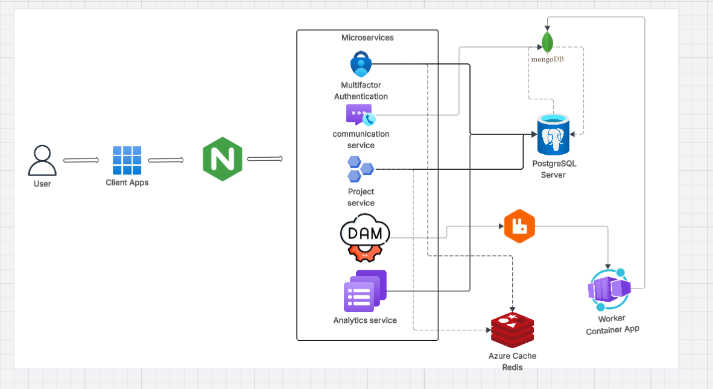
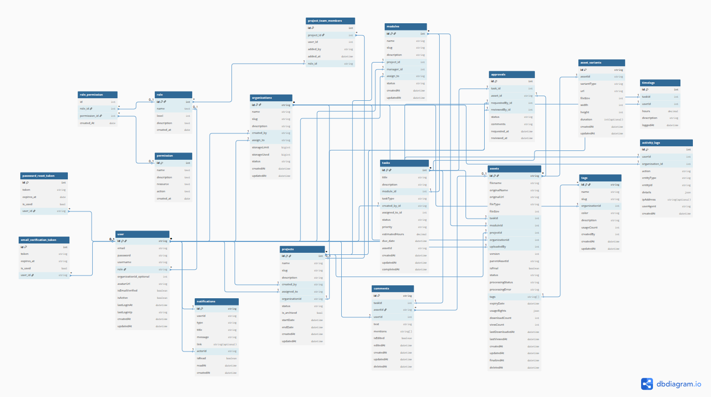

# AXON

A scalable, microservices-based project and asset management platform.

---

## Table of Contents

- [Overview](#overview)
- [Architecture](#architecture)
- [Database Schema](#database-schema)
- [Tech Stack](#tech-stack)
- [Services](#services)
- [Project Structure](#project-structure)
- [Getting Started](#getting-started)
- [Environment Variables](#environment-variables)
- [Running with Docker](#running-with-docker)
- [Development](#development)
- [Testing](#testing)
- [Contributing](#contributing)
- [License](#license)

---

## Overview

AXON is a full-stack, production-grade project management and digital asset platform built on a microservices architecture. It supports multi-organization workspaces, role-based access control, project boards, task management, file uploads, asset versioning, analytics reporting, and more.

### Key Features

- Multi-Organization Support - Manage multiple organizations with request-based onboarding
- Project and Task Management - Jira style compliance boards, task assignments, time logging, and activity tracking
- Asset Management - Upload, version, and review digital assets with approval workflows
- Analytics and Reporting - Platform-wide and project-level reports with PDF export
- Auth and RBAC - JWT-based authentication, email verification, and granular role/permission system
- Email Notifications - Templated emails for verification, password reset, and reports
- Background Workers - Asynchronous image/video processing and report generation via RabbitMQ

---

## Architecture

> 

The platform follows a microservices architecture where each service is independently deployable and communicates via an API Gateway (NGINX) and a message broker (RabbitMQ). The frontend is a React SPA that communicates exclusively through the gateway.

---

## Database Schema

> 


AXON uses a hybrid database approach:

- **PostgreSQL** (via Prisma ORM) - stores users, organizations, projects, tasks, members, roles, permissions, time logs, activity logs, approvals, and access requests.
- **MongoDB** (via Mongoose) - stores assets, asset variants, comments, notifications, and tags.

---

## Tech Stack

| Layer              | Technology                                       |
|--------------------|--------------------------------------------------|
| Frontend           | React, TypeScript, Vite, Tailwind CSS, shadcn/ui |
| Backend Services   | Node.js, Express, TypeScript                     |
| Primary Database   | PostgreSQL with Prisma ORM                       |
| Secondary Database | MongoDB with Mongoose                            |
| Cache              | Redis                                            |
| Message Broker     | RabbitMQ                                         |
| Object Storage     | MinIO                                            |
| File Uploads       | TUS Protocol                                     |
| Auth               | JWT (access + refresh tokens)                    |
| Email              | Nodemailer with custom templates                 |
| Gateway / Proxy    | NGINX                                            |
| Monorepo Tooling   | Turborepo, pnpm workspaces                       |
| Containerization   | Docker, Docker Compose                           |
| Testing            | Vitest                                           |
| Linting            | ESLint, Prettier                                 |
| Commit Linting     | commitlint, Husky                                |

---

## Services

| Service               | Description                                                                  |
|-----------------------|------------------------------------------------------------------------------|
| `gatewayApi`          | NGINX-based API gateway. Single entry point for all client requests.         |
| `authService`         | Handles registration, login, email verification, password reset, and tokens. |
| `projectService`      | Manages organizations, projects, and project members.                        |
| `taskService`         | Manages tasks, comments, time logs, and activity.                            |
| `assetService`        | Handles asset uploads, versioning, variants, and approval workflows.         |
| `uploadService`       | Manages chunked file uploads using the TUS protocol.                         |
| `analyticalService`   | Generates platform-wide, org-level, and project-level analytics.             |
| `worker`              | Background processor for image/video transcoding and PDF report generation.  |
| `web`                 | React frontend SPA.                                                          |

---

## Project Structure

```
AXON/
├── apps/
│   ├── analyticalService/
│   │   └── src/
│   │       ├── controller/
│   │       │   ├── analytics.controller.ts
│   │       │   └── report.controller.ts
│   │       └── routes/
│   │           └── analytics.routes.ts
│   ├── assetService/
│   │   └── src/
│   │       ├── controller/
│   │       │   ├── asset.controller.ts
│   │       │   └── assetVariants.controller.ts
│   │       ├── routes/
│   │       │   ├── asset.routes.ts
│   │       │   └── assetVariant.routes.ts
│   │       └── service/
│   │           ├── asset.service.ts
│   │           ├── assetVariant.service.ts
│   │           └── VariantQueue.service.ts
│   ├── authService/
│   │   └── src/
│   │       ├── controller/
│   │       │   ├── auth.controller.ts
│   │       │   └── user.controller.ts
│   │       ├── routes/
│   │       │   ├── auth.routes.ts
│   │       │   └── user.routes.ts
│   │       └── services/
│   │           ├── auth.service.ts
│   │           ├── token.service.ts
│   │           └── user.service.ts
│   ├── gatewayApi/
│   │   └── src/
│   │       └── index.ts
│   ├── projectService/
│   │   └── src/
│   │       ├── controller/
│   │       │   ├── organization.controller.ts
│   │       │   └── project.controller.ts
│   │       ├── routes/
│   │       │   ├── organization.routes.ts
│   │       │   └── project.routes.ts
│   │       └── services/
│   │           ├── organization.service.ts
│   │           └── project.service.ts
│   ├── taskService/
│   │   └── src/
│   │       ├── controller/
│   │       │   ├── comment.controller.ts
│   │       │   └── task.controller.ts
│   │       ├── routes/
│   │       │   ├── comment.routes.ts
│   │       │   └── task.routes.ts
│   │       └── services/
│   │           ├── comment.service.ts
│   │           └── task.service.ts
│   ├── uploadService/
│   │   └── src/
│   │       ├── routes/
│   │       │   └── upload.routes.ts
│   │       └── service/
│   │           ├── taskHelper.service.ts
│   │           └── upload.service.ts
│   ├── web/
│   │   └── src/
│   │       ├── components/
│   │       ├── config/
│   │       ├── constants/
│   │       ├── helper/
│   │       ├── hooks/
│   │       ├── interfaces/
│   │       ├── lib/
│   │       ├── pages/
│   │       │   ├── auth/
│   │       │   ├── dashboard/
│   │       │   └── projects/
│   │       ├── services/
│   │       ├── store/
│   │       └── validations/
│   └── worker/
│       └── src/
│           ├── helper/
│           │   ├── dashboardData.ts
│           │   └── pdfKit.helper.ts
│           └── processior/
│               ├── image.processor.ts
│               ├── report.processor.ts
│               └── video.processor.ts
├── packages/
│   ├── common/             # Shared services (analytics, permissions, reports, tokens)
│   ├── config/             # Env, logger, mail, MinIO, RabbitMQ, Redis, TUS configs
│   ├── constants/          # Shared constants
│   ├── mail/               # Email templates (verification, reset, report)
│   ├── middlewares/        # Auth, RBAC, rate limiter, error, validation middlewares
│   ├── mongodb/            # MongoDB connection and models
│   ├── postgresql_db/      # Prisma schema, migrations, and seed
│   ├── repository/         # Data access layer for all entities
│   ├── utils/              # API error/response helpers, async handler, date range
│   └── validations/        # Zod schemas for auth, orgs, projects, tasks, users
├── infra/
│   └── nginx/
│       └── default.conf
├── Docker/                 # Per-service Dockerfiles
├── docker-compose.yml
├── docker-compose.dev.yml
├── turbo.json
├── pnpm-workspace.yaml
└── .env.example
```

---

## Getting Started

### Prerequisites

- Node.js >= 18
- pnpm >= 8
- Docker and Docker Compose

### Installation

```bash
# Clone the repository
git clone https://github.com/your-org/axon.git
cd axon

# Install dependencies
pnpm install

# Copy environment variables
cp .env.example .env
```

Fill in the required values in `.env` before proceeding.

---

## Environment Variables

Refer to `.env.example` for the full list of required variables. The key groups are:

| Group       | Variables                                                  |
|-------------|------------------------------------------------------------|
| Database    | `DATABASE_URL` (PostgreSQL), `MONGODB_URI`                 |
| Redis       | `REDIS_HOST`, `REDIS_PORT`                                 |
| RabbitMQ    | `RABBITMQ_URL`                                             |
| MinIO       | `MINIO_ENDPOINT`, `MINIO_ACCESS_KEY`, `MINIO_SECRET_KEY`   |
| Auth        | `JWT_ACCESS_SECRET`, `JWT_REFRESH_SECRET`                  |
| Mail        | `SMTP_HOST`, `SMTP_PORT`, `SMTP_USER`, `SMTP_PASS`         |
| Services    | Individual `PORT` values for each microservice             |

---

## Running with Docker

### Production

```bash
docker-compose up --build
```

### Development

```bash
docker-compose -f docker-compose.dev.yml up --build
```

This starts all services with hot-reload enabled via nodemon.

---

## Development

### Running a specific service locally

```bash
# Run only the authService in dev mode
pnpm --filter authService dev

# Run the web frontend
pnpm --filter web dev
```

### Running all services

```bash
pnpm dev
```

Turborepo handles task orchestration and caching across the monorepo.

### Linting and Formatting

```bash
# Lint all packages
pnpm lint

# Format all packages
pnpm format
```

### Commit Convention

This project enforces [Conventional Commits](https://www.conventionalcommits.org/) via commitlint and Husky.

```bash
# Valid commit format
git commit -m "feat(taskService): add time log endpoint"
git commit -m "fix(authService): handle expired refresh token"
```

---

## Testing

Each service has its own test suite powered by Vitest.

```bash
# Run tests for all services
pnpm test

# Run tests for a specific service
pnpm --filter authService test

# Run tests for a specific service in watch mode
pnpm --filter authService test --watch
```

Test files are colocated with their source under each service's `src/tests/` directory, organized by layer (controllers, services, routes, repositories).

---

## Contributing

Please read [CONTRIBUTING.md](./CONTRIBUTING.md) before submitting a pull request. All contributors are expected to follow the [Code of Conduct](./CODE_OF_CONDUCT.md).

---

## License

This project is licensed under the terms of the [MIT License](./LICENSE).
